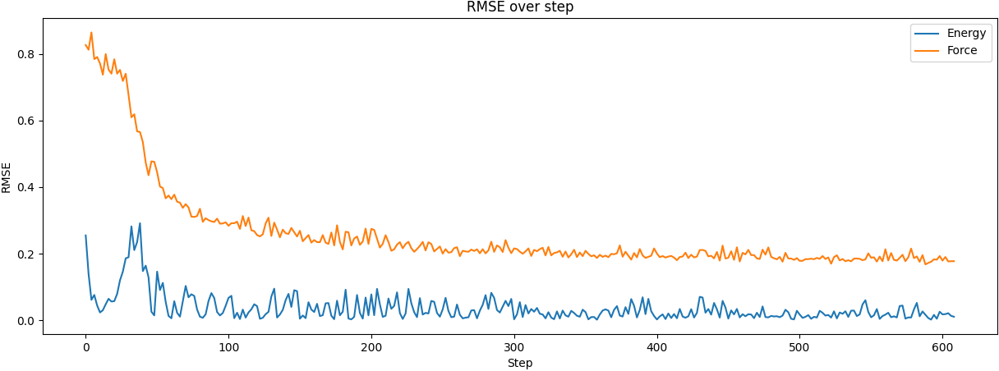

DeePMD-kit on PyTorch
---------------------

For better understand DeePMD-kit, we implement its partial features using PyTorch and expose interface consuing descriptors.

Technical details of our custom `torch.autograd.Function` is explained at [DeePMD 描述符 se_a 前向和反向](https://bytedance.feishu.cn/wiki/wikcnfcYL9NA1L1XwnWUMZ0V9jf).

# Unit Tests

To ensure result consistency between DeePMD-kit and our PyTorch version, 7 unit tests are implemented.

Execute them one by one.
```bash
cd tests
find . -name '*.py' | xargs -I {} python3 -u {}
```

# E2E demo

To verify RMSE decrease during training, a demo INPUT config is prepared.

```bash
ln -s tests/water/data data
python3 -u deepmd_pt/main.py tests/water/se_e2_a.json >train.log 2>&1 &
tail -f lcurve.log  # RMSE values of energy and loss are collected
```

Furthermore, we can draw 2D-line diagram based on the `lcurve.out` file.
```bash
python3 -u visualize.py  # Output is `rmse_over_step.png`
```

Possible graph could be:
